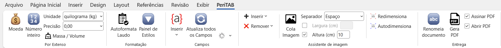

# PeriTAB

Suplemento para Microsoft Word desenvolvido para automatizar e agilizar a elaboração de laudos periciais.

  

---

## 📌 Visão Geral

O **PeriTAB** é um add-in para Microsoft Word que adiciona uma aba personalizada contendo ferramentas voltadas à elaboração de laudos periciais.

O objetivo é aumentar a produtividade, padronizar documentos e reduzir erros operacionais durante a confecção de laudos periciais.

---

## 🌎 Idioma 

A interface, mensagens e documentação estão em **Português (Brasil)**.

---

## ⚙️ Funcionamento

Fluxo típico de uso:

1. Usuário abre o Microsoft Word
2. A aba **PeriTAB** é carregada automaticamente
3. Usuário utiliza os botões disponíveis na aba

---

## 📋 Pré-requisitos

- Windows
- Microsoft Word

---

## 🚀 Instalação

1. Baixe a versão mais recente na aba **Releases**
2. Execute o instalador
3. Abra o Microsoft Word
4. A aba **PeriTAB** estará disponível na interface

---

## 🖥️ Compatibilidade

Testado apenas em:

- Windows 10 e 11
- Microsoft Word 16

---

## 🧩 Estrutura do Projeto

O repositório é dividido em dois módulos principais:

### 🔹 PeriTAB
Responsável por adicionar as funcionalidades ao Word.

- **C#** para o desenvolvimento do add-in
- **VSTO / COM Add-in** para integração com o Microsoft Word
- Integração direta com o modelo de objetos do Word (Interop)

### 🔹 Instalador
Responsável pela distribuição do programa.

- Utiliza Microsoft Visual Studio Installer Projects

---

## 📌 Versionamento

O projeto segue versionamento semântico:

- `v0.x` → versões em desenvolvimento
- `v1.0.0` → primeira versão estável

---

## 👥 Aos contribuidores

- Recomenda-se o uso do Microsoft Visual Studio
- O desenvolvimento foi realizado em:
	- Visual Studio 2022

---
